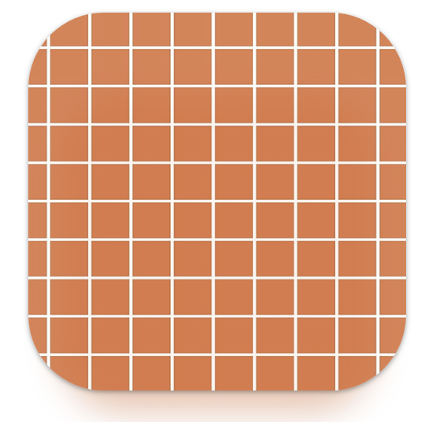
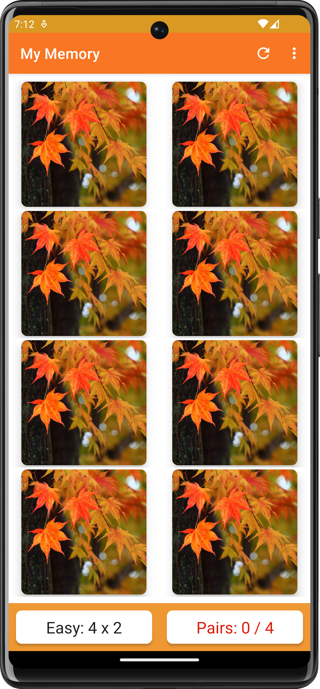
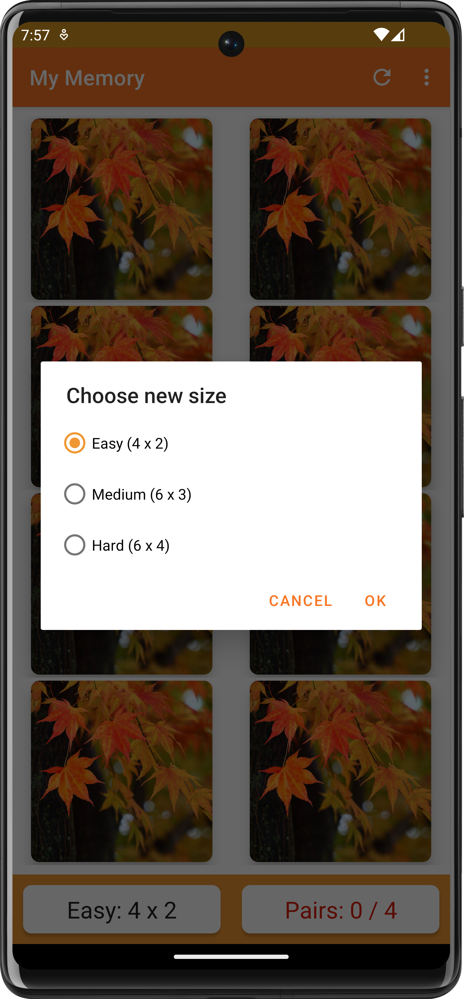
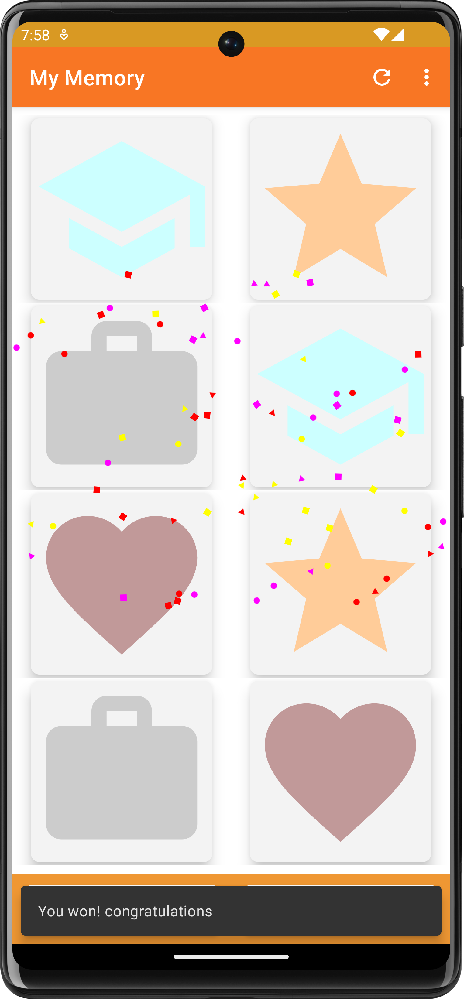

# My Memory
Welcome to My Memory, a customizable memory game that provides endless fun for players of all ages. This README will guide you on how to get started with the game and highlight its key features.

## Getting Started

To start playing My Memory, you have two options:

### Option 1: Download from Google Play Store

1. Visit the Google Play Store using the following link: [My Memory - Google Play Store](https://play.google.com/store/apps/details?id=com.gloria.mymemory&hl=en).
2. Download and install the app from the Play Store.

### Option 2: Search on Google Play Store

1. Open the Google Play Store on your Android device.

2. Search for "My Memory- Image Matching" in the search bar.

3. Look for the game with the following logo

   

### Option 3: Build from Source

1. Ensure you have Android Studio installed and running on your local machine.

2. Clone this repository by running the following command in your terminal

   `git clone https://github.com/gloriadukuzeyesu/myMemory.git`

3. Open the `myMemory` project in Android Studio.
4. Build and run the project on your Android device or emulator.

## Game Features

My Memory offers several exciting features to enhance your gaming experience:

1. **Refresh Functionality**: Restart the game at any time to shuffle the cards and start fresh.
2. **Choose Game Size**: Select the difficulty level by choosing the size of the game board. Available options include:
   - Easy: 4 x 2 grid
   - Medium: 6 x 3 grid
   - Hard: 6 x 4 grid
3. **Create Custom Game**: Customize your game by following these steps:
   - Choose the size of the game board.
   - Upload pictures from your device to be used as cards.
   - Create a unique game name for your custom game.
4. **Download Custom Game**: Share your custom game with friends by following these steps:
   - Instruct your friend to create their own game using the app.
   - Ask them for the name of their game.
   - Search for their game using the provided name and start playing.

## Walkthrough

My Memory Game is a free and customizable memory game that provides endless fun. The game follows the classic picture-matching concept, where players uncover and match pairs of cards. It offers the following features:

- Select from different board sizes: 4x2, 6x3, and 6x4.
- Enjoy playing with vibrant icons in the default mode.
- Personalize the game by using your own photos from your device.
- Share your unique custom game with friends who also have the app.
- Keep track of your moves and successful pairs found.

Experience the game with the default icons or spice it up with your own photos. Creating a custom game allows you to personalize your gaming experience and share it with others.

## ScreenShots

|     |  |
| :----------------------------------------------------------: | :--------------------------------------------------------: |
|                                                              |                                                            |
|  |     |

